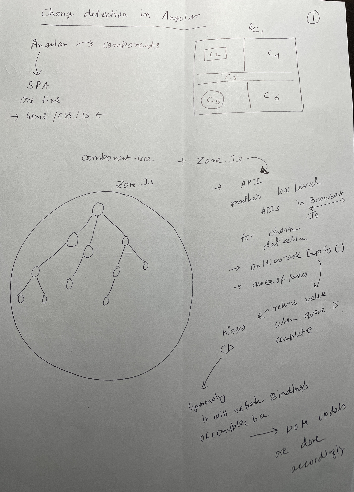
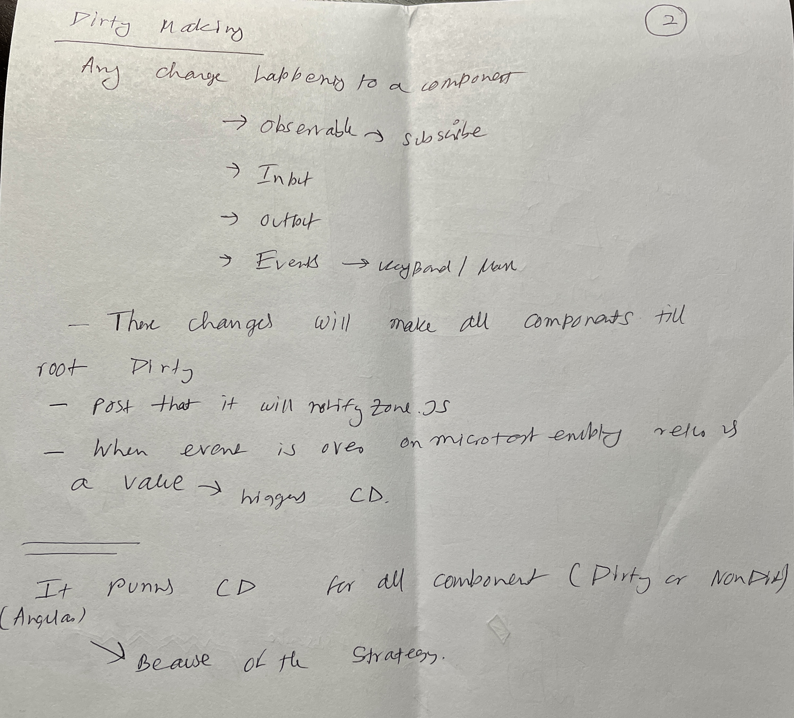
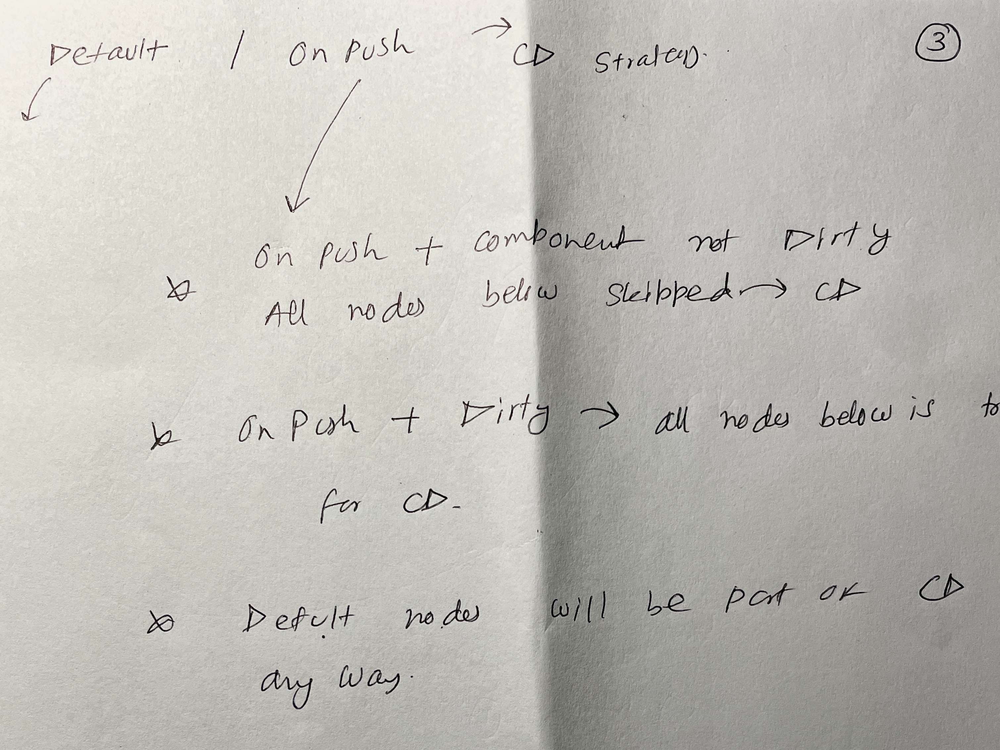

# Angular Change Detection:

## When CD is triggred.
* Angular user an API zone.js to get hints about completed operation.
* zone.js notifies angular when microtasks queue is empty post completing some activity.
* Angular and zone.js has no clue exactly what has changed. 
* zone.js pathes most of the browser api to undenstant event changes.
* Angular triggres CD after receiving hints from zone.js(hints onMircoTaskEmpty subscription returns a value to angular).

## What CD does:
### Defalt mode:
* It traces the complete component tree in DFS and updates all data bindings. Updates DOM(Relevant to the componet) if required as well.
* CD is very efficient but running to often can cause performance issues.

### On push mode:
* It component level not global.
* If a component is marked onPush => and its not dirty. All tree nodes below are skipped in current CD cycle.
* Component: OnPush + Dirty; Complete tree below including it, takes part in CD cycle.

## Component Dirty:
* If following things changes in a component, its marked dirty:
   * Input changes (=== comparison)
      * Not deep comprison is done.
      * If complex object is sent; we need to deal with it properly. It might not trigger input chages.
      * If we are using a parameter of the complex object in template it can trigger input changes, if its a simple object.
   * Output changes.
   * Template bound events.
   * When Data flows from subscription.
   * Direct call to `ChangeDetectorRef.markForCheck()`

## Pictorial Nodes of CD:

||
|-|

||
|-|

||
|-|

## Singnals:
* Next step to CD - Yet to learn.